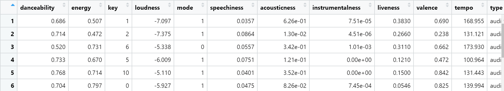
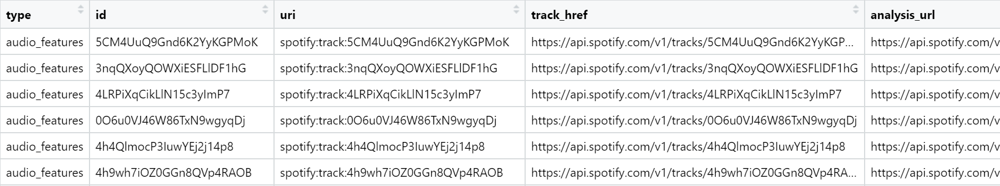
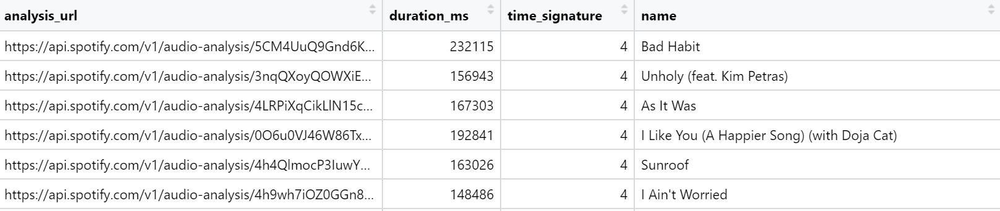
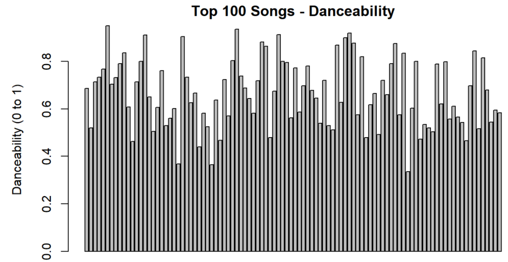
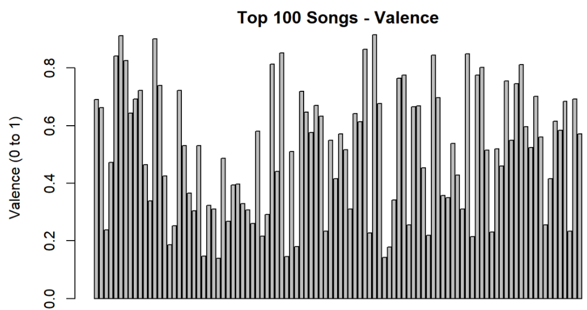
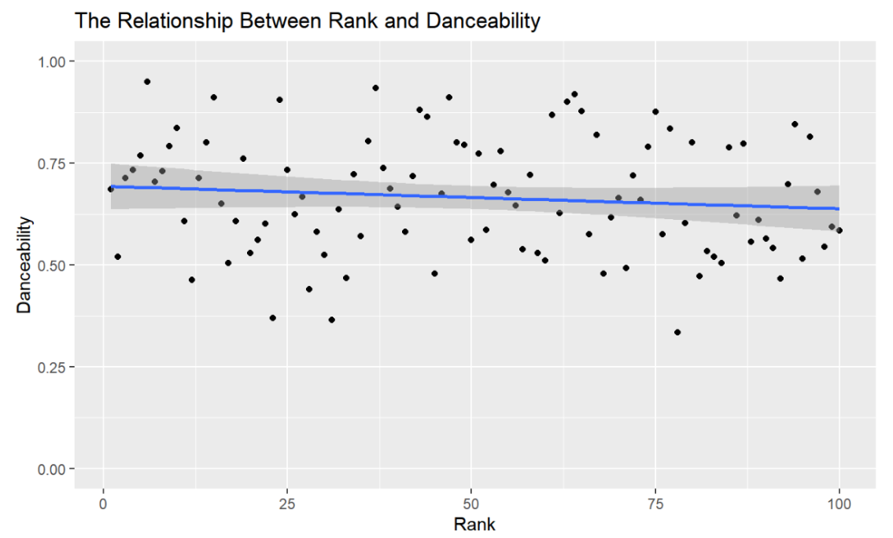
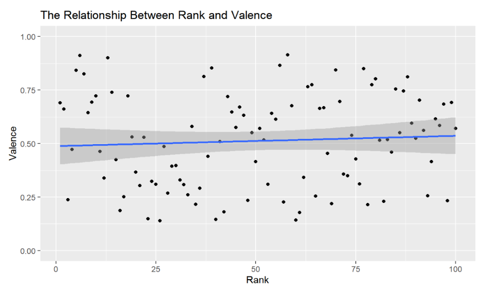
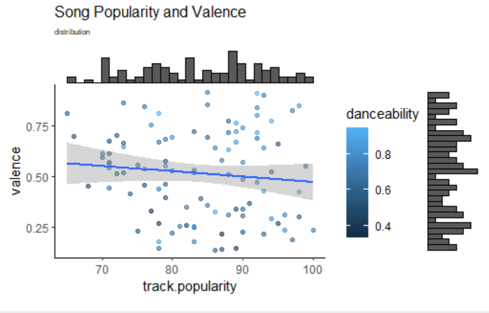
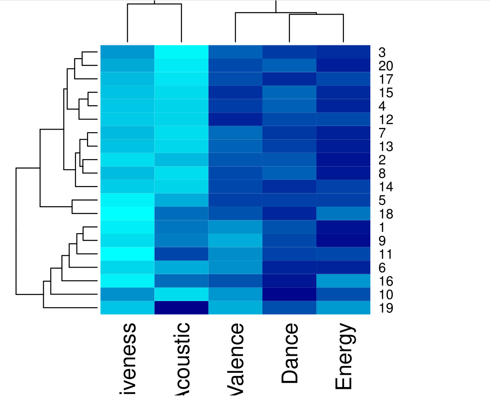

# DS 4001 M2
---

## Table of contents
1. [INTRODUCTION](#introduction)
2. [HYPOTHESIS](#hypothesis)
3. [SRC](#src)
4. [DATA](#data)
5. [FIGURES](#figures)
6. [REFERENCES](#references)

---

## INTRODUCTION

Everyone listens to music, but everybody’s tastes are different. However, there appears to be similarities between songs that become popular. There seems to be similarities in rhythms, beats per minute, and other characteristics of these songs [1]. We would like to dive deeper into what truly makes a Top 100 song by running analyses on certain characteristics in each song. 

In “What Makes a Song Likable”, Ashrith analyzed what factors contribute to the popularity of songs and conducted research on “Top Spotify Tracks of 2017”, a data set on Kaggle. By his scatterplot of the Audio Features parameters, he found that danceability, energy and valence are strongly correlated with the popularity of a song. Danceability explains how suitable a track is for dancing and is measured from 0 to 100. Energy is a measure of intensity and activity. Typically, energetic music is fast and loud. These two variables will increase the chance of being in the Top 50 Spotify songs. Inspired by the result, we would like to investigate if these trends have changed over the past five years. [2]

---

## HYPOTHESIS

**Within the audio features of each song on Spotify, the variables danceability and valence are correlated to the current top 100 most popular songs on Spotify, as a song appearing on the Top 100 chart has a greater likelihood of having a score of 0.5 for danceability, and 0.5 for valence, than having a score below 0.5 for those two variables.**

---

## SRC
 

### Installing/Building Code

First, one must make sure that R and RStudio are installed on their system. Then, you can download the script from our src folder, along with the dataset in the data folder. Make sure that the files are saved into the same directory and change the working directory to where the files are located. 

### Spotity API in R
`spotifyr` is required to access spotify API. It is an R wrapper for pulling audio features and all the information from Spotify's API in bulk. In order to utilize the Spotify API in R, one must install the spotifyr package by running "install.packages('spotifyr)". Then, the spotifyr package needs to be called in the beginning of the R file by running "library(spotifyr)". To get the information from Spotify, one must have authorzation tokens (both client ID and client secret). To do that, one can create a Spotify Developer account and find all the required information on the Dashboard page.

### Usage of Code

One would want to use our code to replicate and verify our results, or to possibly run further analysis on our dataset.

---
## DATA
For full data, please click [here]()

For the data dictionary, please click [here](./data/Data_Dictionary)

The first six rows of our data set are shown below...

This is the final data set the team used for our analysis. To get this data set, the team first subset the top 100 songs by accessing the Spotify API. Then, the team filtered columns by calling `get_track_audio_features`. Lastly, the team added name to each row in the data set. 

---

## FIGURES

### **Figures Table**
* Bar Graph 1: Top 100 Songs - Danceability
* Bar Graph 2: Top 100 Songs - Valence
* Scatterplot 1: The relationship between Rank and Danceability
* Scatterplot 2: The releationship between Rank and Valence
* Valence and Popularity

### **Bar Graph 1: Top 100 Songs - Danceability**

From the bar graph above, we found that most of the top 100 songs have a danceability score of at least 0.4, with many more that are much higher around the 0.5 to 0.8 range, which solidifies our desire to investigate further, as this graph indicates that a higher danceability score may be correlated with popularity ratings on Spotify. 

### **Bar Graph 2: Top 100 Songs - Valence**

From the bar graph above, it is hard to tell whether or not most of the top 100 songs have a valence score higher than 0.5. Therefore, we may need to look for more information about it. For example, we may have to conduct a statistical correlation test to prove our hypothesis.

### **Scatterplot 1: The relationship between Rank and Danceability**

From “The Relationship Between Rank and Danceability,” we found that there is a weak correlation between rank and danceability. A downward sloping line illustrated above is expected because a low rank indicates high popularity of a song. Also, we believed that a part of our hypothesis would not be rejected because the line above is clearly above 0.50.

### **Scatterplot 2: The releationship between Rank and Valence**

From “The Relationship Between Rank and Valence,” we found that there is a weak or almost no correlation between rank and valence. This is a really interesting fact. Additionally, many plots are scattered close to 0.50.

### **Valence and Popularity**

From the graph above, we found that there is a slight correlation betweeen valence and popularity. The trend line has a slighty negative slope, which signifies that there is a slight negative correlation between the valence and the popularity of the song, meaning that a song is more likely to be popular if the valence is lower. Another aspect of the graph above is the coloring of each data point, which correlates to the danceability. For the most part, it seems that the higher valence songs are more danceable, but there is no correlation that can be seen between danceablity and popularity.

### **Heat Map**

According to the heat map shown above, by using a random sample, it is found that our selected songs normally have a high energy score. From the highest to the lowest: energy>danceability>valence> acoustic>liveness. 

---

## REFERENCES

[1]S. Middler, “Is There a Formula to Making a Popular Song?,” Information Expositions F2019, Sep. 16, 2019. https://medium.com/information-expositions-f2019/is-there-a-formula-to-making-a-popular-song-c503530cd729 (accessed Oct. 05, 2022).
‌
[2] Ashrith, “What Makes a Song Likable,” Towards Data Science, Dec. 3, 2018. https://towardsdatascience.com/what-makes-a-song-likeable-dbfdb7abe404
[3].“Web API Reference: Spotify for Developers.” Home, https://developer.spotify.com/documentation/web-api/reference/#/operations/get-recommendations. 
